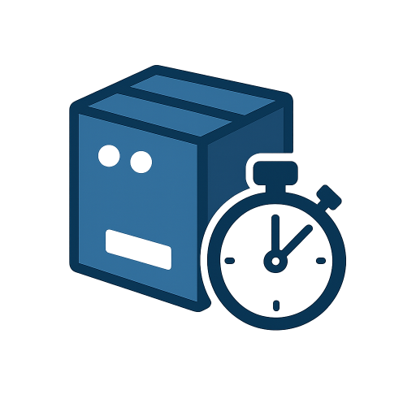

# FluentEndurance
A fluent endurance automation framework whose API helps you to fluently create your endurance tests defining repetitions and timeouts. 



## Samples
For the sake of providing some examples, the solution contains set of tests which simulates certain car features.

In the following snippet the engine must start within 1200 ms and stop within 800 ms. If any of these two operation reach the timing the execution fails. This set of operations will repeat for 50 times. 

```csharp
[Fact]
public Task EngineShouldStartAndStop()
    => UseFeatureSetGroup().For(Times.As(50))
        .WithSet(group => group.Create()
            .WithStep(_engineFeature, (engine, ct) => engine.Start(ct), Milliseconds.As(1200))
            .WithStep(_engineFeature, (engine, ct) => engine.Stop(ct), Milliseconds.As(800)))
        .Run();
```

Which outputs:
```
Executed engine.Start(ct) taking 1007.4665 ms
Executed engine.Stop(ct) taking 60.9244 ms
Executed engine.Start(ct) taking 1002.506 ms
Executed engine.Stop(ct) taking 58.2176 ms
...
```

Timespans can be used in order to define how long the operations must take instead of repeating them certain times.

```csharp
[Fact]
public Task EngineShouldStartRevAndStopDuringTime()
    => UseFeatureSetGroup().During(Minutes.As(1))
        .WithSet(group => group.Create().During(Seconds.As(20))
            .WithStep(_engineFeature, (engine, ct) => engine.Start(ct))
            .WithStep(_engineFeature, (engine, ct) => engine.Rev3000(ct))
            .WithStep(_engineFeature, (engine, ct) => engine.Stop(ct)))
        .Run();
```

Another more complete sample.

```csharp
[Fact]
public Task CarShouldMakeItsRoutineTwice()
    => UseFeatureSetGroup().For(Times.As(2))
        .WithSet(group => group.Create().As("Warm up")
            .WithStep(_engineFeature, (engine, ct) => engine.Start(ct))
            .WithStep(_engineFeature, (engine, ct) => engine.Rev3000(ct)))
        .WithSet(group => group.Create().As("Routine")
            .WithStep(_autopilotFeature, (autopilot, ct) => autopilot.UnPark(ct))
            .WithStep(_gearsFeature, (gears, ct) => gears.ChangeToNeutral(ct))
            .WithStep(_gearsFeature, (gears, ct) => gears.ChangeToDrive(ct)))
        .WithSet(group => group.Create().As("Maneuvers").For(Times.Twice)
            .WithStep(_engineFeature, (engine, ct) => engine.Accelerate100(ct))
            .WithStep(_autopilotFeature, (autopilot, ct) => autopilot.Drive(ct))
            .WithStep(_steeringFeature, (steering, ct) => steering.Left(ct))
            .WithStep(_steeringFeature, (steering, ct) => steering.Forward(ct))
            .WithStep(_steeringFeature, (steering, ct) => steering.Right(ct))
            .WithStep(_steeringFeature, (steering, ct) => steering.Forward(ct))
            .WithStep(_engineFeature, (engine, ct) => engine.Accelerate150(ct))
            .WithStep(_brakesFeature, (brakes, ct) => brakes.BrakeTo50(ct))
            .WithStep(_autopilotFeature, (autopilot, ct) => autopilot.Drive(ct))
            .WithStep(_brakesFeature, (brakes, ct) => brakes.BrakeTo0(ct)))
        .WithSet(group => group.Create().As("Park")
            .WithStep(_engineFeature, (engine, ct) => engine.Stop(ct))
            .WithStep(_autopilotFeature, (autopilot, ct) => autopilot.Park(ct)))
        .Run();
```

## Output status

There are two ways of collecting notifications:
* Live notifications by subscribing to these events. 
* Reading the events each feature has triggered at the end of the test execution.


### Live notifications using notification handlers
```csharp
public MotionTests(ITestOutputHelper output)
    : base(
        _ => { }, 
        services =>
        {
            var notificationHandler = new StatusNotificationHandler();
            notificationHandler.Write += output.WriteLine;
            services.AddSingleton<INotificationHandler<StatusNotification>>(notificationHandler);
            services.AddSingleton<INotificationHandler<PerformanceStatusNotification>>(notificationHandler);
        })
{
    // ...
}
```

### Reading feature events
```csharp
public Task DisposeAsync()
{
    foreach (var notification in _engineFeature.Notifications)
    {
        _output.WriteLine(notification.Content);
    }

    return Task.CompletedTask;
}
```

## License
This project is licensed under the terms of the MIT license. 
Check the [LICENSE](LICENSE.md) file out for license rights and limitations.